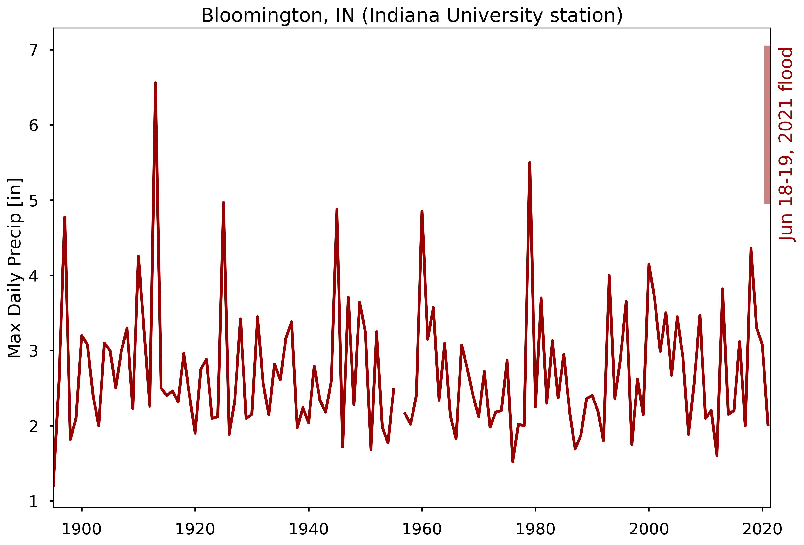

# Public summary

# Analysis
The sections below give a more thorough analysis of the June 18--19, 2021 flood event in Bloomington, IN. 

## Meteorological conditions
The flood was caused by a large amount of precipitation from a [mesoscale convective system (MCS)](https://glossary.ametsoc.org/wiki/Mesoscale_convective_system) associated with a stationary front (see NWS analysis below).  The MCS strengthened overnight on June 18 and remained stationary; precipitation from the storm continued through June 19.  A weather station in Bloomington, IN recorded over 10,000 lightning strikes within a 30 mile radius overnight.

[Local weather observers](https://maps.cocorahs.org/?maptype=precip&units=us&base=std&cp=BluYlwRed&datetype=daily&displayna=0&date=2021-06-19&key=dynamic&overlays=state,county&bbox=-87.06115722656251,38.9524673652846,-86.0723876953125,39.3995914050189) recorded 5--7 inches of rainfall within a 24 hour period.

**Caption**Surface analysis from the [National Weather Service](https://weather.gov) analyzed at approximately 11pm Eastern Friday June 18, 2021.

## Historical records

**Caption** Annual maximum daily precipitation rates for Bloomington, IN from 1895 to 2020.  An estimate of the June 18--19, 2021 flood event total, based on preliminary data from [CoCoRaHS](https://maps.cocorahs.org/?maptype=precip&units=us&base=std&cp=BluYlwRed&datetype=daily&displayna=0&date=2021-06-19&key=dynamic&overlays=state,county&bbox=-87.06115722656251,38.9524673652846,-86.0723876953125,39.3995914050189), is shown as the shaded crimson bar at the right of the graph.  The event ranks somewhere between the 1st--3rd highest daily total on record.

## What does peer-reviewed research say about events like this?

# Copyright
 This work is licensed under a <a rel="license" href="http://creativecommons.org/licenses/by/4.0/">Creative Commons Attribution 4.0 International License</a>.  See *About the authors* for author information.

# Funding

Effort on this work was partially supported by the [Environmental Resilience Institute](https://eri.iu.edu/) at Indiana University: part of the Prepared for Environmental Change Grand Challenge.
  
This research was supported in part by Lilly Endowment, Inc., through its support for the Indiana University Pervasive Technology Institute.  The authors acknowledge the Indiana University Pervasive Technology Institute for providing supercomputing and storage resources that have contributed to the research results reported within this work. 
  
# About the authors
This statement was last update 6/19/2021 
