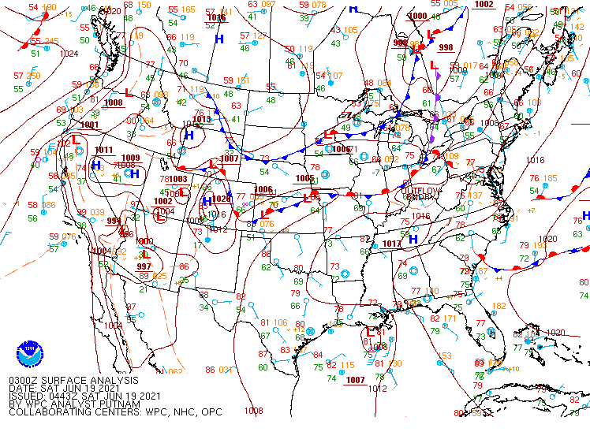
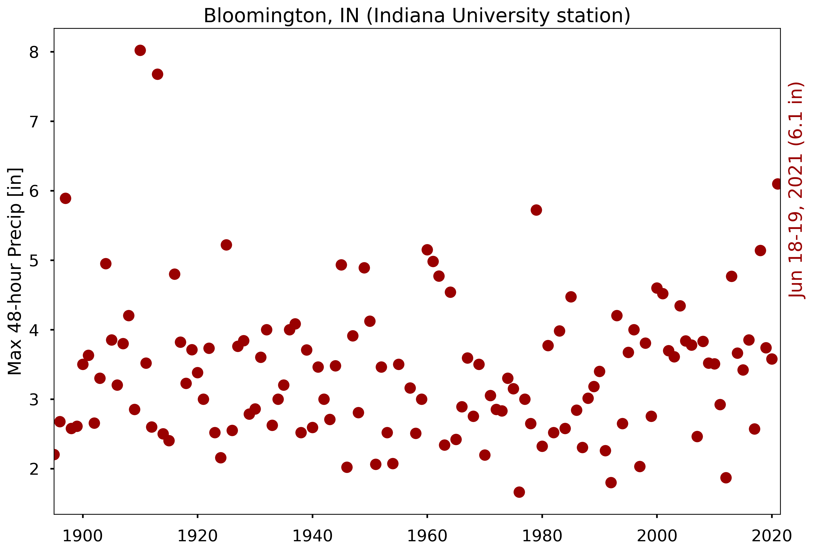
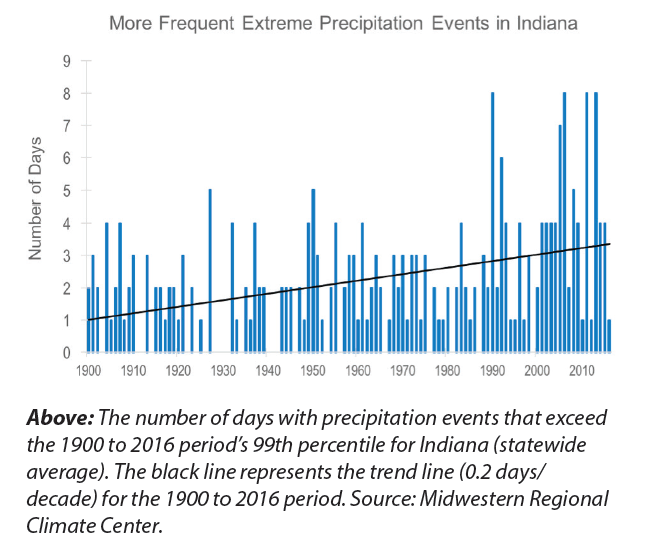
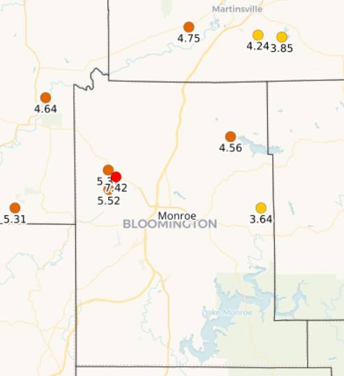

# Plain-language summary
Intense rainfall and flooding occurred in Bloomington, IN overnight on June 18--19, 2021.  The event was caused by a massive complex of thunderstorms that parked over the Bloomington, IN area for over 8 hours.  Preliminary reports show that the system delivered 6.1 inches of rain at the IU Bloomington station, which puts the event as the 3rd on record and the largest in over 100 years.  Regional trends over the last century show an increase in extreme rainfall like this event, which is consistent with fundamental Atmospheric Science theories and climate model simulations of ongoing and future climate change.

# Analysis
The sections below give a more thorough analysis of the June 18--19, 2021 flood event in Bloomington, IN. 

## Meteorological conditions
The flood was caused by a large amount of precipitation from a [mesoscale convective system (MCS)](https://glossary.ametsoc.org/wiki/Mesoscale_convective_system) associated with a [quasi-stationary front](https://glossary.ametsoc.org/wiki/Quasi-stationary_front) (see NWS analysis map below).  The MCS strengthened overnight on June 18 and remained stationary; precipitation from the storm continued through June 19.  A weather station in Bloomington, IN recorded over 10,000 lightning strikes within a 30 mile radius overnight.

[Local weather observers](https://maps.cocorahs.org/?maptype=precip&units=us&base=std&cp=BluYlwRed&datetype=daily&displayna=0&date=2021-06-19&key=dynamic&overlays=state,county&bbox=-87.06115722656251,38.9524673652846,-86.0723876953125,39.3995914050189) recorded 5--7 inches of rainfall within a 24 hour period.

**Caption** Surface analysis from the [National Weather Service](https://weather.gov) analyzed at approximately 11pm Eastern Friday June 18, 2021.

The MCS was associated with abnormally high amounts of instability in the atmosphere, temperatures ~10 F above normal, and strong south winds that brought additional water vapor from the Gulf of Mexico.  The system produced multiple rounds of thunderstorms with intense rainfall rates, which all developed and moved in a "training" pattern continually over the same locations (mostly along highway 46, from Terre Haute to Bloomington)

## Historical records

**Caption** Annual maximum  2-day precipitation total for Bloomington, IN from 1895 to 2021.  The June 18--19, 2021 event produced 6.1 inches of rainfall over 48 hours.  

The June 18--19, 2021 event ranks 3rd in the entire record and is the largest 2-day total in the last 100 years.  Statistical analysis indicates that this was approximately a 30-year event; e.g., we only expect an event of this magnitude once every 30 years or so.  Trend analysis of the above graph is inconclusive; a positive trend cannot be ruled out, but neither can a negative trend.  More advanced statistical analysis can borrow statistical strength from neighboring stations in order to reduce the signal to noise ratio (e.g., Risser et al., 2019; see *Did climate change cause this event?*).

**Caption** Extreme precipitation in Indiana (the top 1% of days of precipitation), which for Bloomington is approximately 1" of rain in a day, have increased substantially since 1900. During the early to mid part of the 20th century, we would have 1-3 such days in a year but we now experience as many as 8 per year. Plot from [INCCIA report](https://docs.lib.purdue.edu/inccia/).  

Several CoCoRaHS sites near Ellettsville had over 5" of rain in the last 24 hours, with one logging 7.42". Nearly all of that occurred within a 6-hour (or shorter) period, so a <0.01 probability of annual occurrence (100+ yr event; see (https://hdsc.nws.noaa.gov/hdsc/pfds/pfds_map_cont.html?bkmrk=in)[https://hdsc.nws.noaa.gov/hdsc/pfds/pfds_map_cont.html?bkmrk=in]). Simple interpolation of those data would place Bloomington around 5" (MC airport did not report hourly precip overnight, so it would be nice to see radar estimates too).

## Did climate change cause this event?
This is a common question about disasters caused by extreme weather events, however it is an ill-posed question, since extreme weather events like this can and have happened in the absence of climate change.  Here are a couple alternate, well-posed questions with answers that are backed by a host peer-reviewed literature:

### Have we observed changes in extreme rainfall like this?
Analysis of precipitation observations shows that the intensity of the 20 year storm (a storm so strong it is only likely to happen once every 20 years) may have increased by approximately 10% over the last century over Indiana (Risser et al., 2019).  The short record makes it difficult to distinguish this trend from noise in the data, however the increasing trend is consistent with theoretical expectations and with climate model simulations (IPCC 2014 and references within), which builds confidence that the observed trend is real and not a statistical artifact.

### How might floods like this change in the future?
Climate model simulations indicate that climate change will (1) increase the frequency of MCS, (2)  cause MCS to cover larger areas, and (3)  to deliver more rainfall in total (Prein et al., 2017).  The overall effect is an increase in the volume of precipitation from these distruptive systems, consistent with the large amount of rainfall delivered over the Bloomington area in the June 18-19, 2021 flood.

1. Risser, M. D., Paciorek, C. J., O’Brien, T. A., Wehner, M. F. & Collins, W. D. Detected Changes in Precipitation Extremes at Their Native Scales Derived from In Situ Measurements. J. Clim. 32, 8087–8109 (2019).
2. Intergovernmental Panel on Climate Change. Climate Change 2014: Synthesis Report; Chapter Observed Changes and their Causes. (2014). doi:10.1046/j.1365-2559.2002.1340a.x
3. Prein, A. F. et al. Increased rainfall volume from future convective storms in the US. Nat. Clim. Chang. 7, 880–884 (2017).

# Copyright
 This work is licensed under a <a rel="license" href="http://creativecommons.org/licenses/by/4.0/">Creative Commons Attribution 4.0 International License</a>.  See *About the authors* for author information.

# Funding

The authors were supported by the Environmental Resilience Institute, funded by Indiana University’s Prepared for Environmental Change Grand Challenge initiative.
  
This research was supported in part by Lilly Endowment, Inc., through its support for the Indiana University Pervasive Technology Institute.  The authors acknowledge the Indiana University Pervasive Technology Institute for providing supercomputing and storage resources that have contributed to the research results reported within this work. 
  
# About the authors
  
Professor [Travis A. O'Brien](https://earth.indiana.edu/directory/faculty/obrien-travis.html) drafted the initial statement and performed the data analysis of historical observations over Bloomington, IN.  Prof. O'Brien is an Assistant Professor in the [Earth and Atmospheric Sciences Department](https://earth.indiana.edu/) at [Indiana University Bloomington](https://www.indiana.edu/) and a faculty researcher associated with the [Environmental Resilience Insistute](https://eri.iu.edu).  Research within his group focuses on understanding what controls weather and climate phenomena that impact human and natural systems. He and his group specialize in utilizing a combination of numerical models, novel data analysis techniques, and fundamental theory to form and test hypotheses about what controls the physical characteristics and occurrence of weather patterns: from fog to extremes. This research focuses on the broad questions of: *What causes characteristics of different weather types to vary from year to year?*,  *How well do different modeling approaches simulate different weather types?*, and *How will anthropogenic climate change affect specific weather types?*.
  
Professor [Cody Kirkpatrick](https://earth.indiana.edu/directory/faculty/kirkpatrick-cody.html) contributed to the *Meteorological conditions* section.  Prof. Kirkpatrick is a Senior Lecturer in the [Earth and Atmospheric Sciences Department](https://earth.indiana.edu/) at [Indiana University Bloomington](https://www.indiana.edu/).  He teaches a range of courses in Atmospheric Sciences, geared toward training new weather forecasters.  His current research activities include: numerical simulations on the morphology and dynamics of deep, moist convection (often referred to as "thunderstorms"), recent climate trends in severe weather forecast parameters (such as wind shear, cloud base heights, and surface temperatures and dewpoints), and understanding the climatology of fire weather conditions in the United States.

Professor [Scott Robeson](https://geography.indiana.edu/about/faculty/robeson-scott.html) contributed to the *Historical records* section.  Prof. Robeson is a Professor in the [Geography Department](https://geography.indiana.edu) at [Indiana University Bloomington](https://www.indiana.edu/).  Prof. Robeson's group does research on climate change detection and impacts, statistical analysis of environmental change, spatial statistics, and time-series analysis.  He was a contributor to the [Indiana Climate Change Impacts Assessment](https://docs.lib.purdue.edu/inccia/).

# Updates
This statement was last updated on 6/21/2021 
